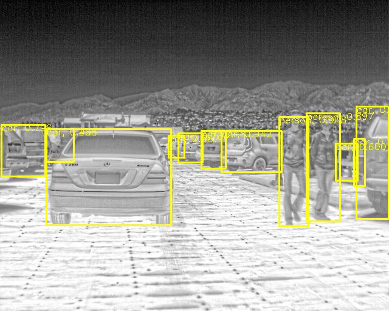

# PMBW - A Paced MultiStage BlockWise approach to Object Detection in Thermal Images

This is the official repo for our paper published in **The Visual Computer 2022**:

## [A Paced MultiStage BlockWise approach to Object Detection in Thermal Images](https://link.springer.com/article/10.1007/s00371-022-02445-x)
[Shreyas Bhat Kera](https://github.com/shreyas-bk), [Anand Tadepalli](https://github.com/AnandT0), [J. Jennifer Ranjani](https://scholar.google.co.in/citations?user=CiidQjUAAAAJ&hl=en)

## Abstract:
The growing advocacy of thermal imagery in applications, such as autonomous vehicles, surveillance, and COVID-19 detection, necessitates accurate object detection frameworks for the thermal domain. Conventional methods could fall short, especially in situations with poor lighting, for instance, detection during night-time. In this paper, we propose a paced multi-stage block-wise framework for effectively detecting objects from thermal images. Our approach utilizes the pre-existing knowledge of deep neural network-based object detectors trained on large-scale natural image data to enhance performance in the thermal domain constructively. The employed, multi-stage approach drives our model to achieve higher accuracies. And the introduction of the pace parameter during domain adaption enables efficient training. Our experimental results demonstrate that the framework outperforms previous benchmarks on the FLIR ADAS dataset on the person, bicycle, and car categories. We have also illustrated further analysis of the framework, such as the effect of its components on accuracy and training efficiency, its generalizability to other thermal datasets, and its superior performance on night-time images in contrast to state-of-the-art RGB object detectors.

## Installation

### 1. Setup a Virtual Environment
Create a virtual environment to isolate dependencies:
```bash
python -m venv pmbw_env
```
Activate the environment:
```bash
source pmbw_env/bin/activate
```

### 2. Install the packages:
```bash
pip install torch torchvision numpy pyyaml tensorboardX tqdm
pip install pycocotools
pip install opencv-python
pip install webcolors
```

### 3. Download the FLIR ADAS Dataset:
https://www.flir.com/oem/adas/adas-dataset-form/?srsltid=AfmBOoph6oe0l5Yz9Se8luW0tFs0u6lkaYv2NjFwzRjGQ_p9h6PqEuTj

### 4. Dataset Directory Structure

The dataset should be organized as follows:

`PMBW_Object_Detection_In_Thermal_Images/<your_dataset>/`

For the example used in the paper, the dataset is **FLIR**.

### Description of Folders and Files
- **train/**: Directory containing training images.
- **val/**: Directory containing validation images.
- **test/**: Directory containing test images.
- **annotations/**: Directory containing annotation files in JSON format:
  - `instances_train.json`: Contains annotations for the training set.
  - `instances_val.json`: Contains annotations for the validation set.
  - `instances_test.json`: Contains annotations for the test set.



## Citation
```
@article{kera2022paced,
  title={A paced multi-stage block-wise approach for object detection in thermal images},
  author={Kera, Shreyas Bhat and Tadepalli, Anand and Ranjani, J Jennifer},
  journal={The Visual Computer},
  pages={1--17},
  year={2022},
  publisher={Springer}
}
```

